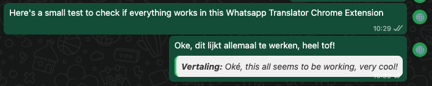
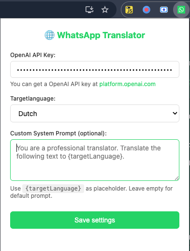

# WhatsApp Translator Chrome Extension

A Chrome extension that translates WhatsApp Web messages using OpenAI's ChatGPT API.

This extension only works with WhatsApp Web (https://web.whatsapp.com/) — it is not
compatible with the WhatsApp desktop or mobile apps. I have chosen not to publish this extension to the Chrome Web Store as it is intended
to be run locally. Additionally, I am uncertain whether this extension fully complies
with Google Chrome's terms of service.

Please note: this extension does not automatically translate incoming messages. Instead,
a small 🌐 icon appears next to each message, which you can click to translate manually.






## Features

### 🌍 Incoming Message Translation
- **One-click translation**: Translate any received message with a single click on the globe icon (🌐)
- **Non-intrusive**: Translation appears below the original message without modifying it

### 📝 Outgoing Message Translation
- **Multi-language support**: Translate your messages to 14+ languages before sending
- **Smart popup interface**: Clean, intuitive translation popup with language selector
- **Copy to clipboard**: Easily copy translated text with one click
- **Language quick-select**: Dropdown appears when you start typing
- **Re-translate option**: Adjust and re-translate with different languages

### 🎯 Supported Languages
- Dutch 
- English 
- German 
- French 
- Spanish 
- Italian 
- Portuguese 
- Russian 
- Chinese
- Japanese

Need more languages? Add them yourself in popup.html or submit an issue.

## Installation

1. **Clone or download this repository**
   ```bash
   git clone https://github.com/yourusername/wa-translator.git
   cd wa-translator
   ```

2. **Open Chrome Extensions page**
   - Navigate to `chrome://extensions/`
   - Enable "Developer mode" (toggle in top-right corner)

3. **Load the extension**
   - Click "Load unpacked"
   - Select the `wa-translator` folder

## Configuration

### Getting an OpenAI API Key

1. Visit [OpenAI Platform](https://platform.openai.com/api-keys)
2. Sign in or create an account
3. Navigate to API Keys section
4. Create a new secret key
5. Copy the key (starts with `sk-...`)

### Setting up the Extension

1. Click the extension icon in Chrome toolbar
2. Paste your OpenAI API key
3. Select your preferred target language for incoming messages 
4. Optional: Add a custom prompt (e.g. for adding context)
5. Click "Save Settings"
6. The WhatsApp Web page will reload automatically

**Note**: Your API key is stored securely in Chrome's sync storage and never leaves your browser except to make API calls to OpenAI.

## Usage

### Translating Incoming Messages

1. Open [WhatsApp Web](https://web.whatsapp.com)
2. Look for the 🌐 globe icon on the right side of each message
3. Click the icon to translate the message
4. The translation appears below the original message in a highlighted box

### Translating Outgoing Messages

1. Start typing a message in the WhatsApp input field
2. A 🌐 globe button and language dropdown will appear
3. Select your target language from the dropdown
4. Click the globe button
5. A popup appears with the translation
6. Click "Copy translation" to copy it to clipboard
7. Paste into the WhatsApp input field and send

**Pro tip**: The translation popup auto-closes after 60 seconds or can be manually closed with the ✕ button.

## Technical Details

### Architecture

The extension consists of three main components:

1. **Content Script** (`content.js`)
   - Injects UI elements (translate buttons, language selectors)
   - Observes DOM changes to add buttons to new messages
   - Handles user interactions and displays translations
   - Communicates with background script via `chrome.runtime.sendMessage`

2. **Background Service Worker** (`background.js`)
   - Handles all API calls to OpenAI
   - Bypasses CORS restrictions (content scripts can't make direct API calls)
   - Processes translation requests asynchronously
   - Returns results to content script

3. **Popup Interface** (`popup.html`, `popup.js`)
   - Settings management UI
   - API key configuration
   - Language preference selection
   - Secure storage using Chrome's sync storage AP

### Translation Context

The extension uses GPT-3.5-turbo with a specialized system prompt:

```
You are a professional translator. Translate the given text to [TARGET_LANGUAGE].
You are translating WhatsApp messages, and the context is usually auto transport.
Return only the translation, no explanation.
```

This ensures:
- Professional translation quality
- Context-awareness for auto transport terminology
- Concise responses without unnecessary explanations

## Development

### Making Changes

1. Make your code changes
2. Go to `chrome://extensions/`
3. Click the reload icon (🔄) on the extension card
4. Reload WhatsApp Web to see changes

### Debugging

**Content Script Console**:
- Open WhatsApp Web
- Press F12 to open DevTools
- Check Console tab for content script logs
- Logs include: "Content: Translating to [LANGUAGE]"

**Background Worker Console**:
- Go to `chrome://extensions/`
- Click "Inspect views: service worker" on the extension card
- Check Console tab for background worker logs
- Logs include: "Background: Translating to [LANGUAGE]"

## Troubleshooting

### Translation not working

**Check API Key**:
- Click extension icon and verify your OpenAI API key is set
- Ensure the key starts with `sk-`
- Verify you have API credits in your OpenAI account

**Check Console**:
- Open browser console (F12)
- Look for error messages
- Check if "Background: Translating to [LANGUAGE]" appears

**Reload Extension**:
- Go to `chrome://extensions/`
- Click reload button on the extension
- Refresh WhatsApp Web

### Translate buttons not appearing

**Check WhatsApp Web**:
- Ensure you're on `https://web.whatsapp.com`
- Wait a few seconds for WhatsApp to fully load
- Try scrolling through messages

**Check Extension Status**:
- Verify extension is enabled in `chrome://extensions/`
- Check for any errors in the extension card

## Privacy & Security

- **API Key Storage**: Your OpenAI API key is stored locally using Chrome's sync storage (encrypted)
- **No Data Collection**: This extension does not collect or transmit any user data except to OpenAI for translation
- **Open Source**: All code is publicly available for audit
- **Secure Communication**: All API calls use HTTPS

## License

MIT License - See LICENSE file for details

## Acknowledgments

- I've built this for internal use, it's as-is.
- Made public to help others with multilingual WhatsApp communication
- Uses OpenAI's GPT-3.5-turbo for high-quality translations

---

**Note**: This is a Chrome extension for WhatsApp Web. It does not work on the WhatsApp mobile app or desktop application.

For issues, feature requests, or contributions, please open an issue or pull request on GitHub.
